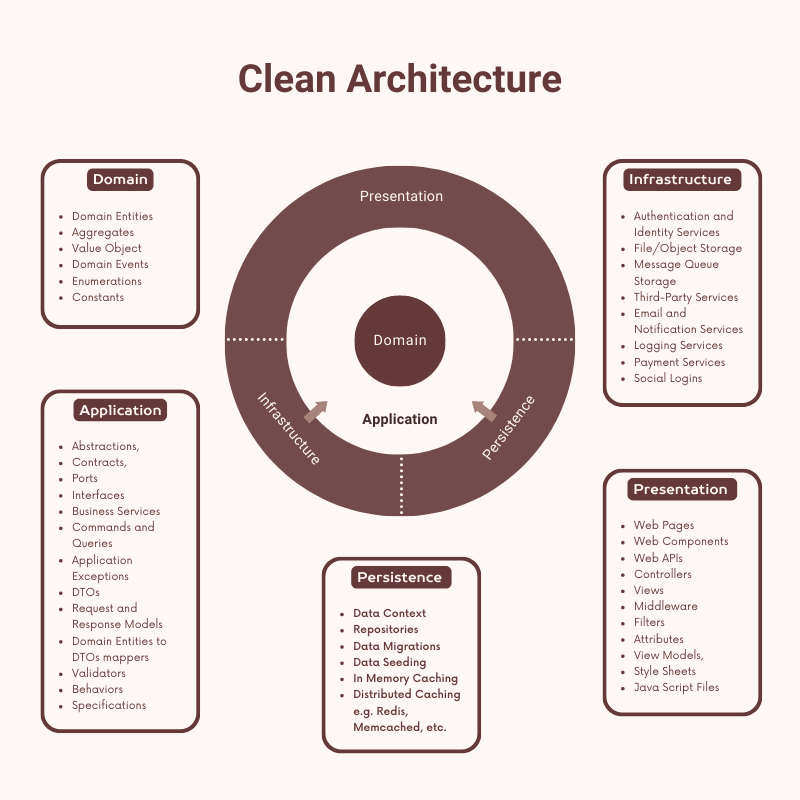

#  CodeStudyMind Blog
*CodeStudyMind* is a blog to sharing technical skill for C#, React, NextJS, Azure and speacially for &dagger; ASP.NET&Dagger;, ...
### Table of Contents
1. **[Installation Instructions](#installation-instructions)** 
2. **[Solution Architecture](#solution-architecture)** 
3. **[Solution Technologies](#Solution-technologies)** 
4. **[Compatibility](#compatibility)** 
5. **[Deployment](#deployment)** 
6. **[Extension Bundles](#extension-bundles)** 

## Solution Technologies
* Create Database schema for blog management *Code first, Lazy Eager Explicit Loading* .
* Use NoSQL MongoDB.
* Apply design pattern **Unit of Work** for web.
* *Authentication and Authorization* apply **(2FA)** Google.
* Apply Unit Test **NUnit** for web.
* Apply Caching **Memory Cache, Redis cache** for web.
* Apply Log **Serilog, Datadog** for web.
* Apply Mapping **AutoMapper** for web.
* Apply API Client and Communication **AutoMapper** for web.
* Apply CI/CD **GitHub Actions/ Azure Pipline**.
* Apply Handling messages  **MediatR**.
* Apply Validation **FluentValidation**.
* Apply **Polly Retry** to define a set of policies, such as retry, circuit breaker, and timeout.
* **Another Technical** *Microservices: Orchestration (Kubernetes), API-Getway(Ocelot) Containerization (Docker) Reverse Proxy(Yarp) Message Queue(Kafka, RabbiMQ)*

## Installation Instructions

### Back-end: ASP.NET 8
Go to the [Nuget Web Store page for *Markdown Here*](https://www.nuget.org/packages/) and install normally.

#### CleanArchitectureDemo.Domain project needs the following nuget packages

- [MediatR (12.0.1)](https://www.nuget.org/packages/MediatR)

#### CleanArchitectureDemo.Application project needs the following nuget packages

- [MediatR (12.0.1)](https://www.nuget.org/packages/MediatR)
- [Microsoft.EntityFrameworkCore (8.0.5)](https://www.nuget.org/packages/Microsoft.EntityFrameworkCore)
- [AutoMapper (12.0.1)](https://www.nuget.org/packages/automapper/)
- [AutoMapper.Extensions.Microsoft.DependencyInjection (12.0.1)](https://www.nuget.org/packages/AutoMapper.Extensions.Microsoft.DependencyInjection)
- [FluentValidation (11.5.2)]("https://www.nuget.org/packages/FluentValidation)
- [FluentValidation.AspNetCore (11.3.0)](https://www.nuget.org/packages/FluentValidation.AspNetCore)

#### CleanArchitectureDemo.Persistence project needs the following nuget packages

- [MediatR (12.0.1)](https://www.nuget.org/packages/MediatR)
- [Microsoft.EntityFrameworkCore (8.0.5)](https://www.nuget.org/packages/Microsoft.EntityFrameworkCore)
- [Microsoft.EntityFrameworkCore.SqlServer (8.0.5)](https://www.nuget.org/packages/Microsoft.EntityFrameworkCore.SqlServer/)
- [Microsoft.Extensions.Configuration (8.0.0)](https://www.nuget.org/packages/Microsoft.Extensions.Configuration/)

#### CleanArchitectureDemo.WebAPI project needs the following nuget packages

- [MediatR (12.0.1)](https://www.nuget.org/packages/MediatR)

### Front-end: NextJS

## Solution Architecture

1. Clean Architecture

## Features
### On Backend project

-  Entities
-  Dtos
-  Context
-  ORM
-  Http Methods
-  Swagger
-  Postman
-  Postman Collections

### On Frontend project

-  Sending state while redirecting user
-  Nested Routing
-  useState
-  useEffect
-  Sweet Alert on Create, Edit and Delete
-  Confirmation on Delete
-  Elegant, Beatifull and fully Responsive Navbar
-  TypeScript Interface
-  TypeScript Partial
-  Axios
-  SASS
-  Mixin
-  Moment

# Finally

[**Visit the website.**](http://markdown-here.com) 
[**Get it for Chrome.**](https://chrome.google.com/webstore/detail/elifhakcjgalahccnjkneoccemfahfoa) 
[**Get it for Firefox.**](https://addons.mozilla.org/en-US/firefox/addon/markdown-here/) 
[**Get it for Safari.**](https://s3.amazonaws.com/markdown-here/markdown-here.safariextz) 